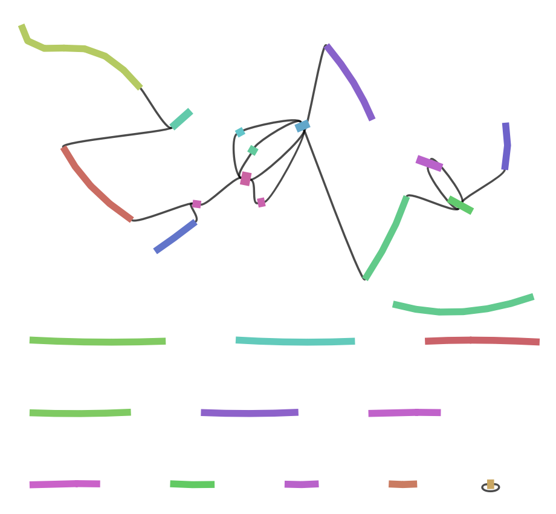
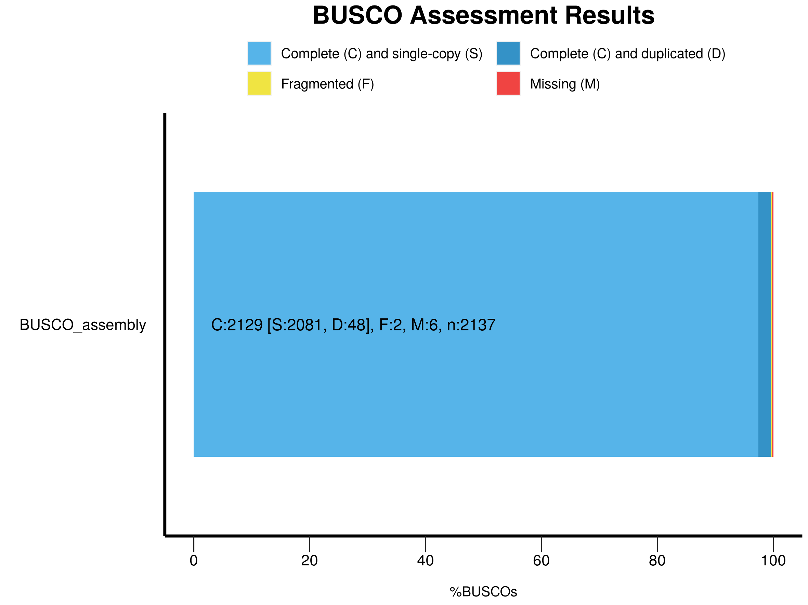

# BINP29 PacBio Long Read Assembly Excersice
Exercise in Long Read _de novo_ assembly for BINP29 course.

## Program versions

```
sra-tools               3.0.1
fastqc                  0.12.1
flye                    2.9.3
quast                   5.2.0
busco                   5.6.1
```


## Setting up the data

```
# Folder to store raw data
mkdir 00_RAW

# Download the SRR reads
fasterq-dump SRR13577846 --threads 10 --progress --outdir 00_RAW/
```

## Quality Control
From the FastQC report we see that everything is in order.
The quality is above 36 and the peak is at phred score of 92.
```
# Folder to store FastQC report
mkdir 01_QC

# Run FastQC
fastqc -o 01_QC -f fastq -t 10 00_RAW/SRR13577846.fastq
```

## _De novo_ assembly
The data is HiFi PacBio SMRT long reads, thus the flag `--pacbio-hifi` is
used.
```
# Creating out directory
mkdir 03_FLYE

# Flye command
flye --pacbio-hifi 00_RAW/SRR13577846.fastq --out-dir 03_FLYE --threads 10
```
## Assembly Quality Control with QUAST and BUSCO
The graph shows that most of the contigs are solved but we have ca four
contigs that are troublesome to assemble. Probably high repeats.



### QUAST
I am not interested in the icarus viewer so i specify not to build it 
using `--no-icarus`.
```
mkdir 04_QUAST

# QUAST call
quast -o 04_QUAST/ -r 00_RAW/GCF_000146045.2_R64_genomic.fna -t 12 --no-icarus 03_FLYE/assembly.fasta
```

#### QUAST results
As we see the genome fractions is very high, almost 100%.
However it is not perfect as the NGA50 is 35% of the N50

| Genome statistics       | assembly   |
|-------------------------|------------|
| Genome fraction (%)     | 97.266     |
| Duplication ratio       | 1.017      |
| Largest alignment       | 843303     |
| Total aligned length    | 12030510   |
| NGA50                   | 284119     |
| NG50 and N50            | 809074     |
| GC %                    | 38.3       |


### BUSCO

```
mkdir 05_BUSCO

# BUSCO call
busco -i 03_FLYE/assembly.fasta -m genome -c 12 --out_path 05_BUSCO/ -l saccharomycetes_odb10
```

    ---------------------------------------------------
    |Results from dataset saccharomycetes_odb10        |
    ---------------------------------------------------
    |C:99.6%[S:97.4%,D:2.2%],F:0.1%,M:0.3%,n:2137      |
    |2129    Complete BUSCOs (C)                       |
    |2081    Complete and single-copy BUSCOs (S)       |
    |48    Complete and duplicated BUSCOs (D)          |
    |2    Fragmented BUSCOs (F)                        |
    |6    Missing BUSCOs (M)                           |
    |2137    Total BUSCO groups searched               |
    ---------------------------------------------------


### BUSCO PLOT

```
# Generating plots
generate_plot.py -wd 05_BUSCO/BUSCO_assembly.fasta/
```

